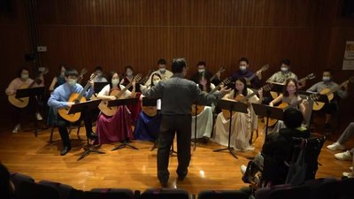
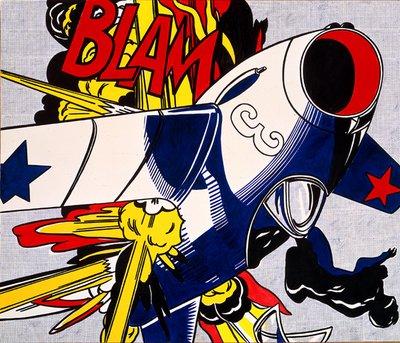
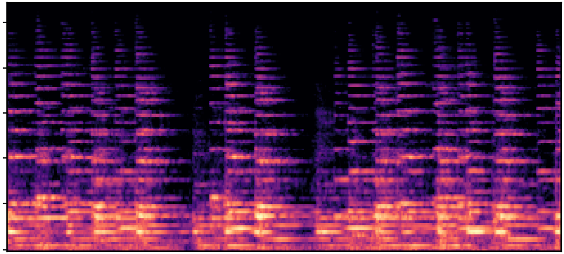
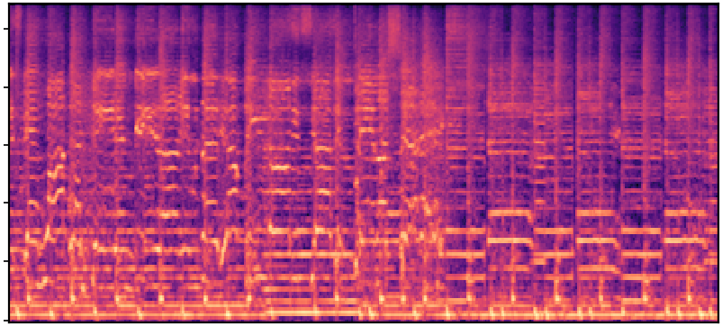
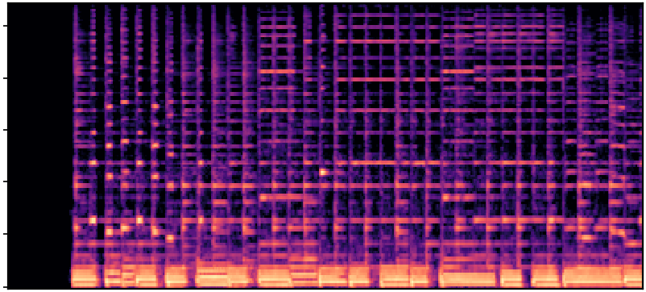
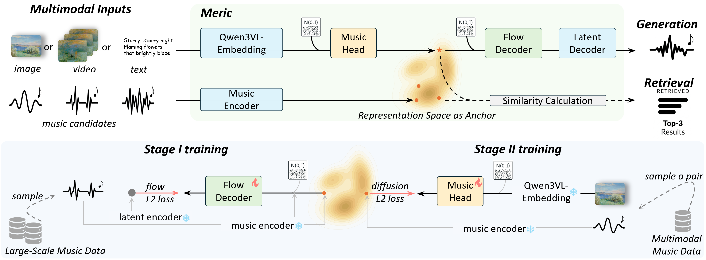
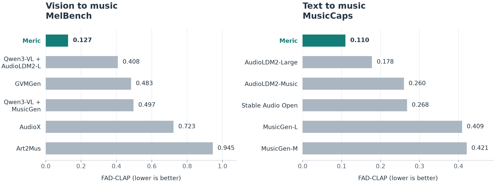

# Meric

**A Unified Framework for Multimodal Music Generation and Retrieval via Representation Space Anchoring**

Accepted to ECCV 2026.

[Project page](https://audiofool.blog/meric/) | [Model weights](https://huggingface.co/Audiofool/meric) | [Documentation](docs/SETUP.md) | [Reproducibility](docs/REPRODUCIBILITY.md) | [Roadmap](docs/ROADMAP.md)

Meric generates 44.1 kHz music from images, videos, and text.
It maps every input modality into a shared MuQ music representation, then renders that representation with a flow-matching audio decoder.
The same anchored representation is used for the paper's cross-modal retrieval experiments.

### From images to music

| Guitar ensemble | Pop art | Mountain landscape |
|:---:|:---:|:---:|
|  |  |  |
|  |  |  |

Input images above, Meric-generated mel spectrograms below (10 seconds, 44.1 kHz), reproduced from the paper's qualitative examples.
[Listen to generated music on the project page](https://audiofool.blog/meric/#i2m-gallery), including [multiple musical interpretations of one image](https://audiofool.blog/meric/#one-to-many).

## Framework



The Music Head makes the cross-modal mapping stochastic, which represents the one-to-many relationship between a visual or textual prompt and plausible music.
The acoustic decoder can be trained with unpaired music because it consumes the shared MuQ representation rather than the original modality.
The figure numbers the training phases: acoustic decoder first, Music Head second.

## Release status

The repository currently supports pinned pretrained inference, Music Head training with prepared inputs, exact camera-ready result tables, and partial Flow Decoder training-code inspection.
Full paper retraining and table regeneration additionally require data and evaluation artifacts that are not yet public.
Unchecked work is tracked in the public [roadmap](docs/ROADMAP.md), while correctness, licensing, and launch gates are tracked in the maintainer [release checklist](docs/RELEASE_CHECKLIST.md).
An unchecked roadmap item must not be interpreted as an available artifact or a promised release date.

## Installation

Meric is tested with Python 3.10, PyTorch 2.5.1, and CUDA 12.1 on Linux.
Model downloads require roughly 30 GB of free disk space.

```bash
git clone https://github.com/Audiofool934/meric.git
cd meric

python3.10 -m venv .venv
source .venv/bin/activate

pip install torch==2.5.1 torchvision==0.20.1 torchaudio==2.5.1 \
    --index-url https://download.pytorch.org/whl/cu121
pip install -e .
```

The released Music Heads use Qwen3-VL-Embedding in a separate Python 3.11 environment because its dependency versions conflict with the audio runtime.
The setup helper checks out the tested upstream revision and downloads the tested 2B embedding model revision.

```bash
python -m pip install uv==0.9.26
bash scripts/setup_qwen3vl.sh
export QWEN3VL_REPO="$PWD/.external/Qwen3-VL-Embedding"
```

See [docs/SETUP.md](docs/SETUP.md) for Conda, offline setup, environment overrides, and troubleshooting.

## Quick start

Weights are downloaded from [Audiofool/meric](https://huggingface.co/Audiofool/meric) on first use and are pinned to an immutable Hub revision.
Generated files include a `manifest.json` with seeds, settings, input and output checksums, and upstream model revisions.

```bash
# Image to music
meric generate --image examples/images/sample_sunset.jpg --output-dir outputs/image

# Text to music through Qwen3-VL and the Music Head
meric generate --text "A calm piano melody with gentle rain" --output-dir outputs/text

# Video to music
meric generate --video path/to/clip.mp4 --video-max-frames 8 --output-dir outputs/video

# Three deterministic variants with seeds 42, 43, and 44
meric generate --image examples/images/sample_ocean.jpg -n 3 --seed 42 --output-dir outputs/variants

# Available Music Heads
meric models
```

Python API:

```python
from meric import MericPipeline

pipe = MericPipeline.from_pretrained("meric-sft-v3", device="cuda:0")

image_wavs = pipe.generate(image="photo.jpg", n=3, seed=42, output_dir="outputs/image")
text_wavs = pipe.generate(text="lo-fi piano in the rain", output_dir="outputs/text")
video_wavs = pipe.generate(video="clip.mp4", video_max_frames=8, output_dir="outputs/video")
```

For an exact variant set, pass `seeds=[7, 11, 23]` to `pipe.generate`.
A direct MuQ input is also supported with `muq=<numpy array or .npy path>`.
See [docs/USAGE.md](docs/USAGE.md) for all inference options and the supported training commands.

## Released checkpoints

| Model | File | Purpose |
|---|---|---|
| `meric-sft-v3` | `rdm_sft_v3.pth` | Camera-ready paper Music Head and default model |
| `meric-instrumental` | `rdm_sft_instrumental.pth` | Music Head fine-tuned for instrumental output |
| Shared Stage 2 | `mericldm.ckpt` | MuQ-conditioned flow decoder used by both Music Heads |

Exact byte sizes, SHA-256 checksums, Hub revisions, and upstream component revisions are recorded in [docs/MODELS.md](docs/MODELS.md).
No model weights are stored in Git.

The source code is Apache-2.0, but the released Stage-2 checkpoint derives from Stable Audio Open and also serializes frozen MuQ-MuLan parameters.
It is therefore subject to the Stability AI Community License and the MuQ weight license, CC BY-NC 4.0.
Review [NOTICE](NOTICE) before redistribution or commercial use.

## Camera-ready results

The following values are transcribed from the final camera-ready tables.
Lower FAD and KL are better, while higher Sem is better.



Selected vision-to-music and text-to-music benchmarks, showing every baseline from the corresponding camera-ready tables.
The complete results across datasets and metrics are in [docs/RESULTS.md](docs/RESULTS.md).

### Vision-to-music generation

| Dataset | FAD-MERT | FAD-CLAP | FAD-VGG | KL-MERT | Sem |
|---|---:|---:|---:|---:|---:|
| MelBench | **1.55** | **0.127** | **1.27** | **0.0059** | 74.7 |
| MuImage | **1.79** | **0.169** | **3.20** | **0.0078** | 87.1 |
| EmoMV | **3.06** | **0.253** | **2.45** | 0.0060 | **81.0** |
| ARIA | **3.30** | **0.247** | 2.08 | 0.0055 | **79.6** |

### Text-to-music generation

| Dataset | FAD-MERT | FAD-CLAP | Sem |
|---|---:|---:|---:|
| MusicCaps | **1.87** | **0.110** | 74.2 |
| ARIA | **2.14** | **0.155** | 74.5 |

Complete generation, retrieval, baseline, and ablation tables are in [docs/RESULTS.md](docs/RESULTS.md).
The evaluation protocol and exact public artifact boundary are described in [docs/REPRODUCIBILITY.md](docs/REPRODUCIBILITY.md).

## Repository layout

```text
meric/             Installable package, public API, model code, and inference engine
scripts/           Supported training scripts and release verification helpers
tests/             CPU unit and smoke tests
docs/              Setup, usage, architecture, model, result, and data documentation
examples/          CC0 sample inputs
```

The stable user surface is `meric.MericPipeline` and the `meric` command.
Internal experiment histories, incomplete post-submission work, and environment-specific baseline adapters are maintained in the private research repository rather than presented as supported public code.

## Data

Stage 1 is pretrained on 369K cross-modal pairs drawn from AudioSet-Music, MelBench, and EmoMV after YouTube-ID deduplication, then fine-tuned on ARIA.
ARIA contains 5K images with generated captions and instrumental music, using a 4K/1K train/test split.
Dataset availability, preparation, and third-party terms are documented in [docs/DATA_INVENTORY.md](docs/DATA_INVENTORY.md) and [NOTICE](NOTICE).

## Citation

```bibtex
@inproceedings{wang2026meric,
  title     = {Meric: A Unified Framework for Multimodal Music Generation and Retrieval via Representation Space Anchoring},
  author    = {Wang, Xihua and Wang, Yinbo and Zhang, Jingchao and Song, Ruihua},
  booktitle = {European Conference on Computer Vision},
  year      = {2026}
}
```

Xihua Wang, Yinbo Wang, and Jingchao Zhang contributed equally.
Ruihua Song is the corresponding author.

Proceedings pages, DOI, and the arXiv identifier will be added when those records are available.

## License

The repository source code is licensed under the [Apache License 2.0](LICENSE).
Model weights, datasets, and upstream components retain their respective licenses and are not relicensed under Apache-2.0.
See [NOTICE](NOTICE) for the complete attribution and license summary.
